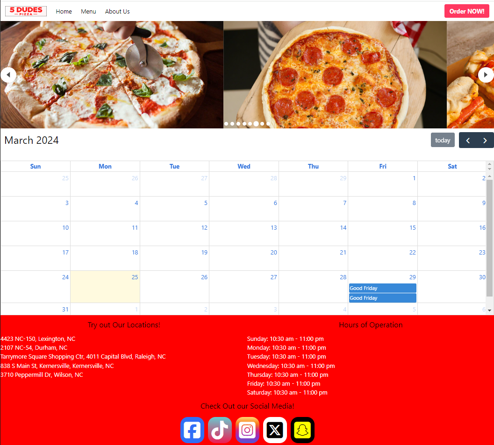
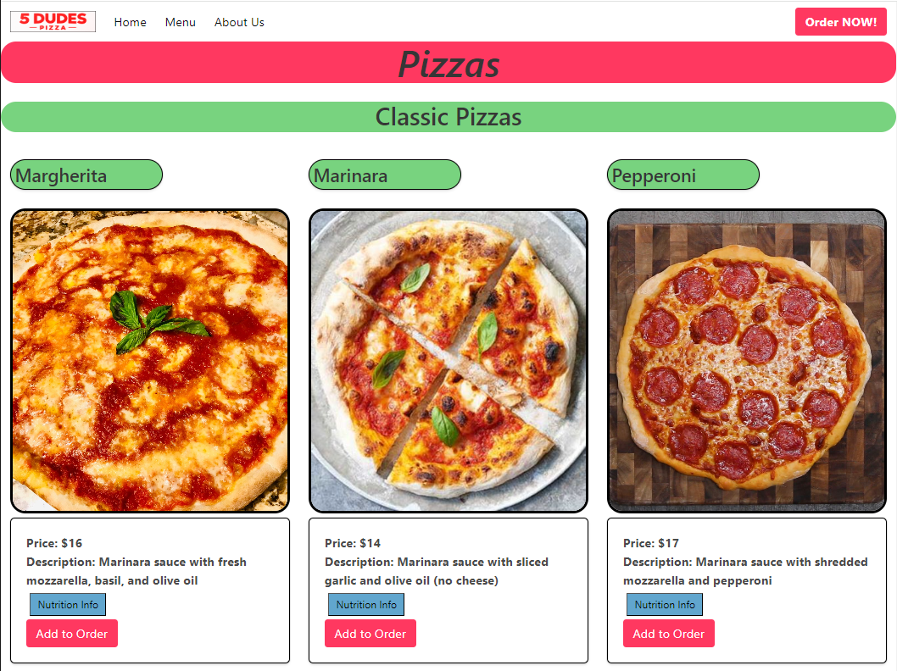
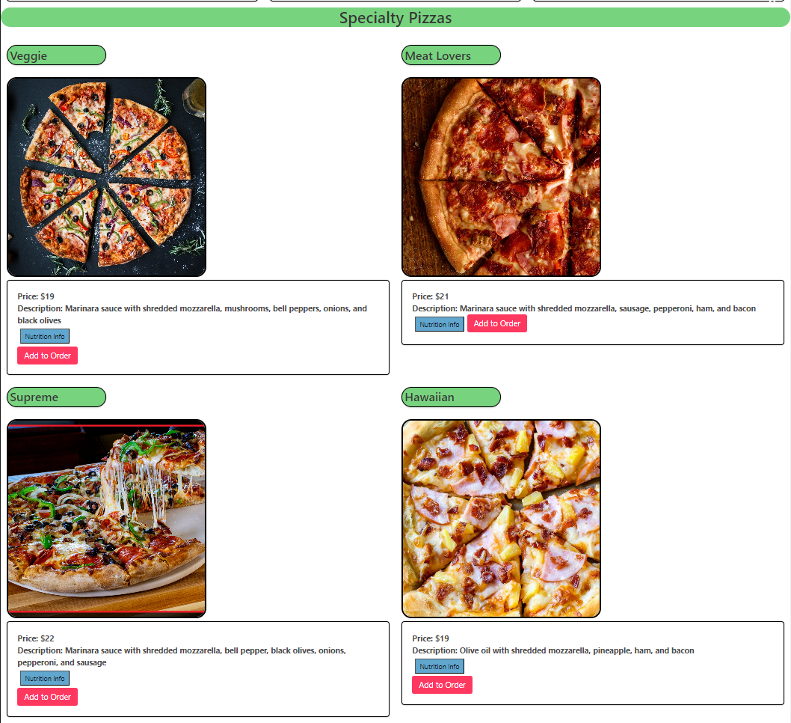
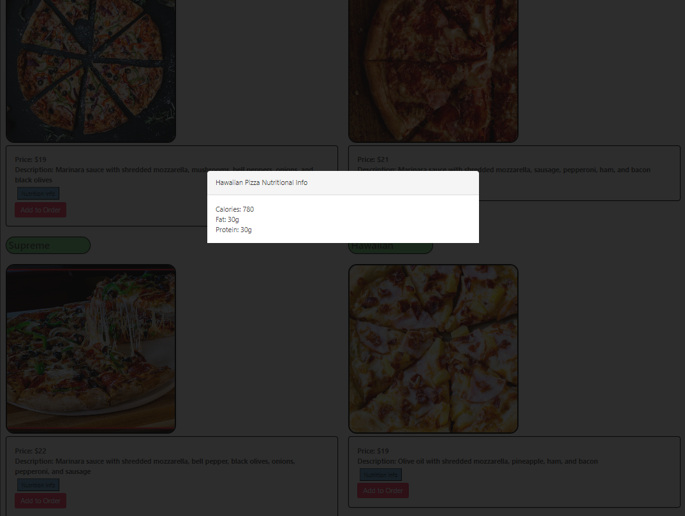
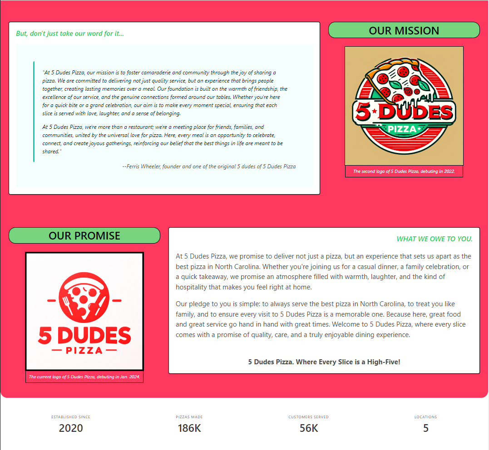
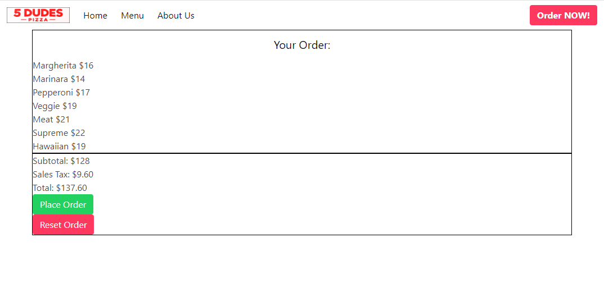

# Five Dudes Pizza

## Description

A local pizzaria chain needed an interactive website that allowed their customers to order pizzas online. They needed to minimize time spent taking pickup orders over the phone. Online orders would save time and labor which allows more customers to be served. The website will showcase the pizzas along with descriptions, prices, pictures, and nutrional information. An about me page is also created to give additional information about the company.

## Table of Contents (Optional)

If your README is long, add a table of contents to make it easy for users to find what they need.

- [Installation](#installation)
- [Usage](#usage)
- [Credits](#credits)
- [License](#license)

## Installation

Browser with local storage required to place orders. 
Website can be accessed at: https://dfreeman3102.github.io/five-dudes-pizza/

## Usage

When visiting the site, users are greeted with a carousel of images and a calendar showing days we are closed. Users can also find our hours of operation, different locations, and links to social media accounts. The navbar on top allows users to conveniently navigate to each page.

The menu page shows the pizzas offered. It is divided by classic pizzas and specialty pizzas. Each pizza is displayed along with the price and decription for that pizza. Users also have the option to see nutritional information of each pizza. To order a pizza, users need to press the "Add to Order" button shown under each pizza. The pizza will be saved to local storage.

The about us page shows the story, the mission, and the promise of Five Dudes Pizza. The logos throughout the years are displayed. The footer showcases the year the company was established, how many pizzas were made, how many customers served, and how many locations there are.

The order page displays the user's order along with prices. The subtotal, sales tax, and total are displayed. The place order places the order and sends it to the pizzaria and clears the order from local storage. User's can use the "Reset Order" button if there is an issue with the order.

## Credits

GitHub public apis provided links to APIs used:
https://github.com/public-apis/public-apis

Nager.Date was used for the calendar feature:
https://date.nager.at/

Foodish was used for images:
https://foodish-api.com/

Edamam and Spoonacular API were used for ingredients and nutritional information:
https://www.edamam.com/
https://spoonacular.com/food-api

## License

MIT License

Copyright (c) 2024 jinkc21

Permission is hereby granted, free of charge, to any person obtaining a copy
of this software and associated documentation files (the "Software"), to deal
in the Software without restriction, including without limitation the rights
to use, copy, modify, merge, publish, distribute, sublicense, and/or sell
copies of the Software, and to permit persons to whom the Software is
furnished to do so, subject to the following conditions:

The above copyright notice and this permission notice shall be included in all
copies or substantial portions of the Software.

THE SOFTWARE IS PROVIDED "AS IS", WITHOUT WARRANTY OF ANY KIND, EXPRESS OR
IMPLIED, INCLUDING BUT NOT LIMITED TO THE WARRANTIES OF MERCHANTABILITY,
FITNESS FOR A PARTICULAR PURPOSE AND NONINFRINGEMENT. IN NO EVENT SHALL THE
AUTHORS OR COPYRIGHT HOLDERS BE LIABLE FOR ANY CLAIM, DAMAGES OR OTHER
LIABILITY, WHETHER IN AN ACTION OF CONTRACT, TORT OR OTHERWISE, ARISING FROM,
OUT OF OR IN CONNECTION WITH THE SOFTWARE OR THE USE OR OTHER DEALINGS IN THE
SOFTWARE.
---